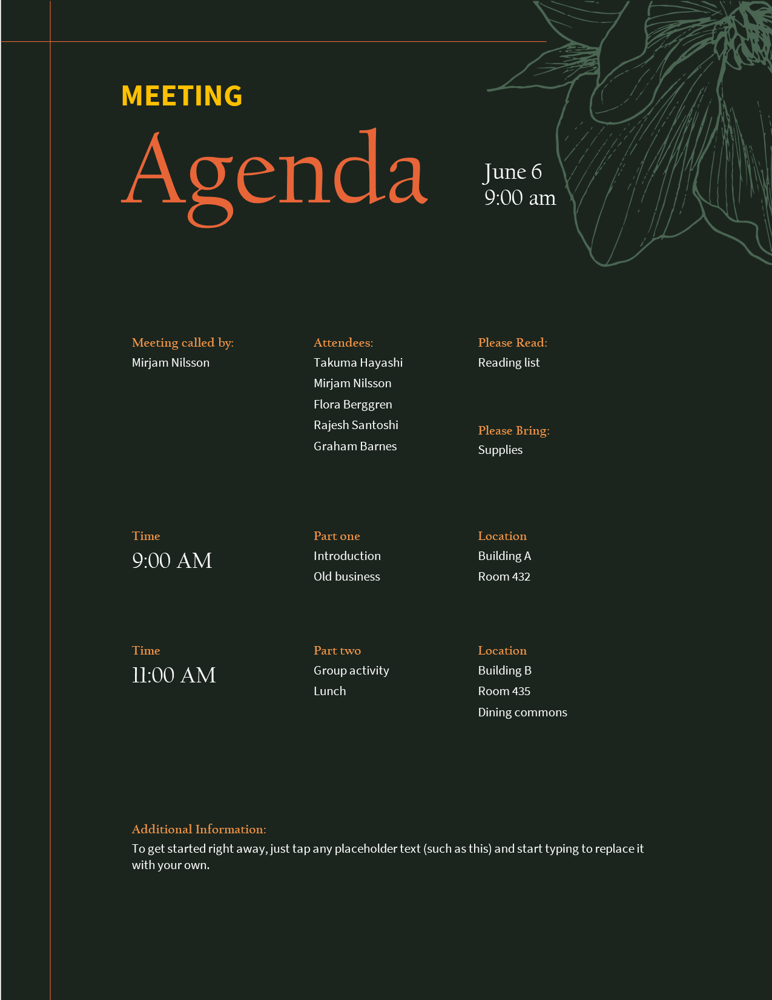

# agendas-minutes/10

### Top-right flower silhouette renders via the custGeom path renderer

The decorative pink leaf cluster in the top-right is a `wsp` with `<a:custGeom>` whose single
`<a:path>` holds **277 separate closed contours** (277 `moveTo`, 275 `close`) built from 2442
cubic Béziers, with a solid fill. `ShapeParser.ExtractSubpaths` flattens the curves and keeps
each `moveTo`…`close` run as its own contour, so the renderers fill a multi-contour path
(SkiaSharp `SKPath`, ImageSharp `PathBuilder`) with **nonzero winding** — the DrawingML default.

This is the scenario that motivated the path renderer: collapsing every `moveTo` into one
polyline (the earlier behaviour) fused the 277 contours into a single self-crossing blob joined
by connector lines. Keeping the contours separate reproduces Word's crisp leaf outlines.
ArcTo-based custGeom is still unsupported and falls back to the bounding rect.

| Expected (Word) | Skia | ImageSharp |
| --- | --- | --- |
| **Page 1**&nbsp;&nbsp;&nbsp;&nbsp;&nbsp;&nbsp;&nbsp;&nbsp;&nbsp;&nbsp;&nbsp;&nbsp;&nbsp;&nbsp;&nbsp;&nbsp;&nbsp;&nbsp;&nbsp; | **Page 1. ErrorMetric: 0.0516** | **Page 1. ErrorMetric: 0.0561** |
|  |  |  |
