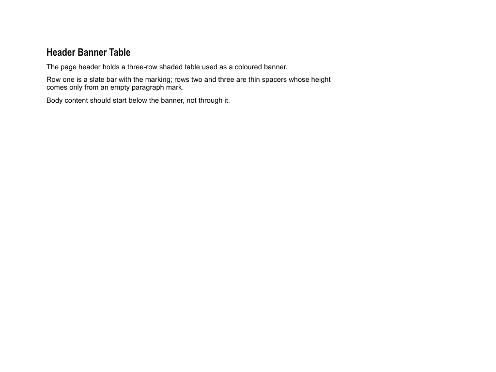

# All HTML export scenarios (322)

The HTML exporter rendered to PNG via the headless-browser screenshot pipeline.

Contents

- [agendas-minutes/01](#agendas-minutes01)
- [agendas-minutes/02](#agendas-minutes02)
- [agendas-minutes/03](#agendas-minutes03)
- [agendas-minutes/04](#agendas-minutes04)
- [agendas-minutes/05](#agendas-minutes05)
- [agendas-minutes/06](#agendas-minutes06)
- [agendas-minutes/07](#agendas-minutes07)
- [agendas-minutes/08](#agendas-minutes08)
- [agendas-minutes/09](#agendas-minutes09)
- [agendas-minutes/10](#agendas-minutes10)
- [agendas-minutes/11](#agendas-minutes11)
- [agendas-minutes/12](#agendas-minutes12)
- [agendas-minutes/13](#agendas-minutes13)
- [agendas-minutes/14](#agendas-minutes14)
- [agendas-minutes/15](#agendas-minutes15)
- [agendas-minutes/16](#agendas-minutes16)
- [agendas-minutes/17](#agendas-minutes17)
- [agendas-minutes/18](#agendas-minutes18)
- [agendas-minutes/19](#agendas-minutes19)
- [align_center](#align_center)
- [align_justified](#align_justified)
- [align_left](#align_left)
- [align_mixed](#align_mixed)
- [align_right](#align_right)
- [all_caps](#all_caps)
- [bar_tabs](#bar_tabs)
- [block_quote](#block_quote)
- [bold_text](#bold_text)
- [brochures/01](#brochures01)
- [brochures/02](#brochures02)
- [brochures/03](#brochures03)
- [brochures/04](#brochures04)
- [brochures/05](#brochures05)
- [brochures/06](#brochures06)
- [brochures/07](#brochures07)
- [brochures/08](#brochures08)
- [bullet_list](#bullet_list)
- [business-plans/01](#business-plans01)
- [business-plans/02](#business-plans02)
- [business-plans/03](#business-plans03)
- [business-plans/04](#business-plans04)
- [business-plans/05](#business-plans05)
- [business-plans/06](#business-plans06)
- [business-plans/07](#business-plans07)
- [business-plans/08](#business-plans08)
- [business-plans/09](#business-plans09)
- [business-plans/10](#business-plans10)
- [business-plans/12](#business-plans12)
- [business-plans/13](#business-plans13)
- [business-plans/15](#business-plans15)
- [business/01](#business01)
- [business/02](#business02)
- [business/03](#business03)
- [business/04](#business04)
- [business/05](#business05)
- [business/06](#business06)
- [cards/01](#cards01)
- [cards/02](#cards02)
- [cards/03](#cards03)
- [cards/04](#cards04)
- [cards/05](#cards05)
- [cards/06](#cards06)
- [cards/07](#cards07)
- [cards/08](#cards08)
- [cards/09](#cards09)
- [cards/10](#cards10)
- [cards/11](#cards11)
- [cards/12](#cards12)
- [cards/13](#cards13)
- [cards/15](#cards15)
- [cards/16](#cards16)
- [cards/18](#cards18)
- [cards/19](#cards19)
- [colored_text](#colored_text)
- [column_breaks](#column_breaks)
- [comments/01](#comments01)
- [compatibility_mode_14](#compatibility_mode_14)
- [complex_document](#complex_document)
- [complex_spacing](#complex_spacing)
- [complex_tables](#complex_tables)
- [content_control_inline](#content_control_inline)
- [cover-letters/01](#cover-letters01)
- [cover-letters/02](#cover-letters02)
- [cover-letters/03](#cover-letters03)
- [cover-letters/04](#cover-letters04)
- [cover-letters/05](#cover-letters05)
- [cover-letters/06](#cover-letters06)
- [cover-letters/07](#cover-letters07)
- [cover-letters/08](#cover-letters08)
- [cover-letters/09](#cover-letters09)
- [cover-letters/10](#cover-letters10)
- [cover-letters/11](#cover-letters11)
- [cover-letters/12](#cover-letters12)
- [cover-letters/14](#cover-letters14)
- [cover-letters/15](#cover-letters15)
- [cover-letters/16](#cover-letters16)
- [custom_margins](#custom_margins)
- [decimal_tabs/01](#decimal_tabs01)
- [deep_nested_list](#deep_nested_list)
- [document_capture/01](#document_capture01)
- [document_protection/01](#document_protection01)
- [dot_points](#dot_points)
- [embedded_font](#embedded_font)
- [empty_paragraphs](#empty_paragraphs)
- [even_odd_headers/01](#even_odd_headers01)
- [even_odd_headers/02](#even_odd_headers02)
- [explicit_break_blank_page](#explicit_break_blank_page)
- [feature_capture/01](#feature_capture01)
- [field_codes_simple/01](#field_codes_simple01)
- [first_line_indent](#first_line_indent)
- [font_families](#font_families)
- [font_sizes](#font_sizes)
- [footer](#footer)
- [form_checkboxes](#form_checkboxes)
- [form_dropdowns](#form_dropdowns)
- [form_text_fields](#form_text_fields)
- [gutter_margins/01](#gutter_margins01)
- [hanging_indent](#hanging_indent)
- [header](#header)
- [header_banner_table](#header_banner_table)
- [header_footer](#header_footer)
- [header_row_repeat/01](#header_row_repeat01)
- [headings](#headings)
- [html_basic_formatting](#html_basic_formatting)
- [html_complex](#html_complex)
- [html_css_alignment](#html_css_alignment)
- [html_css_borders](#html_css_borders)
- [html_css_colors](#html_css_colors)
- [html_css_margin_padding](#html_css_margin_padding)
- [html_font_tag](#html_font_tag)
- [html_headings](#html_headings)
- [html_images](#html_images)
- [html_inline_styles](#html_inline_styles)
- [html_links](#html_links)
- [html_lists](#html_lists)
- [html_nested_lists](#html_nested_lists)
- [html_paragraphs](#html_paragraphs)
- [html_table](#html_table)
- [html_table_cellpadding](#html_table_cellpadding)
- [html_table_cell_margin_css](#html_table_cell_margin_css)
- [html_table_cell_padding_css](#html_table_cell_padding_css)
- [html_table_styled](#html_table_styled)
- [hyperlinks](#hyperlinks)
- [hyphenation_auto](#hyphenation_auto)
- [hyphenation_nonbreaking](#hyphenation_nonbreaking)
- [hyphenation_soft](#hyphenation_soft)
- [hyphenation_suppressed](#hyphenation_suppressed)
- [icons_multiple](#icons_multiple)
- [icon_svg](#icon_svg)
- [icon_with_text](#icon_with_text)
- [image_cropping/01](#image_cropping01)
- [image_rotation/01](#image_rotation01)
- [image_wrap_square](#image_wrap_square)
- [inline_image](#inline_image)
- [inline_shape_arrows](#inline_shape_arrows)
- [italic_text](#italic_text)
- [labels/01](#labels01)
- [labels/02](#labels02)
- [labels/03](#labels03)
- [labels/04](#labels04)
- [labels/05](#labels05)
- [labels/06](#labels06)
- [labels/07](#labels07)
- [labels/08](#labels08)
- [labels/09](#labels09)
- [labels/10](#labels10)
- [labels/11](#labels11)
- [labels/12](#labels12)
- [labels/13](#labels13)
- [labels/14](#labels14)
- [labels/15](#labels15)
- [labels/16](#labels16)
- [left_indent](#left_indent)
- [letters/01](#letters01)
- [letters/02](#letters02)
- [letters/03](#letters03)
- [letters/04](#letters04)
- [letters/05](#letters05)
- [letters/06](#letters06)
- [letters/07](#letters07)
- [letters/08](#letters08)
- [letters/09](#letters09)
- [letters/10](#letters10)
- [letters/11](#letters11)
- [letters/12](#letters12)
- [letters/13](#letters13)
- [line_breaks](#line_breaks)
- [line_numbers_continuous](#line_numbers_continuous)
- [line_numbers_count_by_5](#line_numbers_count_by_5)
- [line_numbers_custom_distance](#line_numbers_custom_distance)
- [line_numbers_restart_page](#line_numbers_restart_page)
- [line_numbers_restart_section](#line_numbers_restart_section)
- [line_numbers_suppressed](#line_numbers_suppressed)
- [line_spacing](#line_spacing)
- [line_spacing_at_least](#line_spacing_at_least)
- [line_spacing_exactly](#line_spacing_exactly)
- [long_paragraph](#long_paragraph)
- [menus/01](#menus01)
- [menus/02](#menus02)
- [menus/03](#menus03)
- [menus/04](#menus04)
- [menus/05](#menus05)
- [menus/06](#menus06)
- [menus/07](#menus07)
- [menus/08](#menus08)
- [menus/09](#menus09)
- [mixed_breaks](#mixed_breaks)
- [mixed_formatting](#mixed_formatting)
- [multiple_images](#multiple_images)
- [multiple_pages](#multiple_pages)
- [multiple_paragraphs](#multiple_paragraphs)
- [nested_list](#nested_list)
- [newsletters/01](#newsletters01)
- [newsletters/02](#newsletters02)
- [newsletters/03](#newsletters03)
- [newsletters/04](#newsletters04)
- [newsletters/05](#newsletters05)
- [newsletters/06](#newsletters06)
- [newsletters/07](#newsletters07)
- [newsletters/08](#newsletters08)
- [newsletters/09](#newsletters09)
- [newsletters/10](#newsletters10)
- [newsletters/11](#newsletters11)
- [newsletters/12](#newsletters12)
- [newsletters/13](#newsletters13)
- [newsletters/14](#newsletters14)
- [numbered_list](#numbered_list)
- [numbered_list_restart](#numbered_list_restart)
- [numbered_list_tracking](#numbered_list_tracking)
- [office_math](#office_math)
- [page_a4](#page_a4)
- [page_borders/01](#page_borders01)
- [page_breaks](#page_breaks)
- [page_landscape](#page_landscape)
- [page_legal](#page_legal)
- [page_letter](#page_letter)
- [page_numbers](#page_numbers)
- [paragraph_borders](#paragraph_borders)
- [paragraph_spacing](#paragraph_spacing)
- [pct_pos_offset](#pct_pos_offset)
- [postcards/01](#postcards01)
- [postcards/02](#postcards02)
- [postcards/03](#postcards03)
- [postcards/04](#postcards04)
- [resumes/01](#resumes01)
- [resumes/02](#resumes02)
- [resumes/03](#resumes03)
- [resumes/04](#resumes04)
- [resumes/05](#resumes05)
- [resumes/06](#resumes06)
- [resumes/07](#resumes07)
- [resumes/08](#resumes08)
- [resumes/09](#resumes09)
- [resumes/10](#resumes10)
- [resumes/11](#resumes11)
- [resumes/12](#resumes12)
- [resumes/13](#resumes13)
- [resumes/14](#resumes14)
- [resumes/15](#resumes15)
- [resumes/16](#resumes16)
- [resumes/17](#resumes17)
- [resumes/18](#resumes18)
- [resumes/19](#resumes19)
- [rtl_paragraph](#rtl_paragraph)
- [section_break_continuous](#section_break_continuous)
- [section_break_even_page](#section_break_even_page)
- [section_break_next_page](#section_break_next_page)
- [section_break_odd_page](#section_break_odd_page)
- [simple_paragraph](#simple_paragraph)
- [simple_table](#simple_table)
- [small_caps](#small_caps)
- [strikethrough_text](#strikethrough_text)
- [subscript_superscript](#subscript_superscript)
- [table_alignment/01](#table_alignment01)
- [table_autofit_no_widths](#table_autofit_no_widths)
- [table_borders](#table_borders)
- [table_cell_margin_per_cell](#table_cell_margin_per_cell)
- [table_cell_padding](#table_cell_padding)
- [table_cell_padding_varied](#table_cell_padding_varied)
- [table_cell_spacing/01](#table_cell_spacing01)
- [table_colors](#table_colors)
- [table_default_cell_margin](#table_default_cell_margin)
- [table_default_cell_margin_start_end](#table_default_cell_margin_start_end)
- [table_default_style](#table_default_style)
- [table_default_style_first_row_run_color](#table_default_style_first_row_run_color)
- [table_default_style_first_row_shading](#table_default_style_first_row_shading)
- [table_default_style_inside_h](#table_default_style_inside_h)
- [table_default_style_outer_borders](#table_default_style_outer_borders)
- [table_diagonal_borders/01](#table_diagonal_borders01)
- [table_explicit_heights](#table_explicit_heights)
- [table_grid_styling_padding](#table_grid_styling_padding)
- [table_indent](#table_indent)
- [table_layout_tall_row](#table_layout_tall_row)
- [table_multipage](#table_multipage)
- [table_of_contents/01](#table_of_contents01)
- [table_of_contents/02](#table_of_contents02)
- [table_of_contents/03](#table_of_contents03)
- [table_page_break](#table_page_break)
- [table_text_direction](#table_text_direction)
- [table_two_column_layout](#table_two_column_layout)
- [table_vmerge_basic](#table_vmerge_basic)
- [table_vmerge_explicit_heights](#table_vmerge_explicit_heights)
- [tab_stops](#tab_stops)
- [text_wrapping_break](#text_wrapping_break)
- [three_columns](#three_columns)
- [tracked_changes/01](#tracked_changes01)
- [two_columns](#two_columns)
- [underline_text](#underline_text)
- [wedding/01](#wedding01)
- [wedding/02](#wedding02)
- [wedding/03](#wedding03)
- [wedding/04](#wedding04)
- [wedding/05](#wedding05)
- [wedding/06](#wedding06)
- [wedding/07](#wedding07)
- [wedding/08](#wedding08)
- [wedding/09](#wedding09)
- [wedding/10](#wedding10)
- [wedding/11](#wedding11)
- [wide_table](#wide_table)
- [wordart](#wordart)
- [wordart-envelope](#wordart-envelope)

## agendas-minutes/01

| Morph HTML |
| --- |
|  |

## agendas-minutes/02

| Morph HTML |
| --- |
|  |

## agendas-minutes/03

| Morph HTML |
| --- |
|  |

## agendas-minutes/04

| Morph HTML |
| --- |
|  |

## agendas-minutes/05

| Morph HTML |
| --- |
|  |

## agendas-minutes/06

| Morph HTML |
| --- |
|  |

## agendas-minutes/07

| Morph HTML |
| --- |
|  |

## agendas-minutes/08

| Morph HTML |
| --- |
|  |

## agendas-minutes/09

| Morph HTML |
| --- |
|  |

## agendas-minutes/10

| Morph HTML |
| --- |
|  |

## agendas-minutes/11

| Morph HTML |
| --- |
|  |

## agendas-minutes/12

| Morph HTML |
| --- |
|  |

## agendas-minutes/13

| Morph HTML |
| --- |
|  |

## agendas-minutes/14

| Morph HTML |
| --- |
|  |

## agendas-minutes/15

| Morph HTML |
| --- |
|  |

## agendas-minutes/16

| Morph HTML |
| --- |
|  |

## agendas-minutes/17

| Morph HTML |
| --- |
|  |

## agendas-minutes/18

| Morph HTML |
| --- |
|  |

## agendas-minutes/19

| Morph HTML |
| --- |
|  |

## align_center

| Morph HTML |
| --- |
|  |

## align_justified

| Morph HTML |
| --- |
|  |

## align_left

| Morph HTML |
| --- |
|  |

## align_mixed

| Morph HTML |
| --- |
|  |

## align_right

| Morph HTML |
| --- |
|  |

## all_caps

| Morph HTML |
| --- |
|  |

## bar_tabs

| Morph HTML |
| --- |
|  |

## block_quote

| Morph HTML |
| --- |
|  |

## bold_text

| Morph HTML |
| --- |
|  |

## brochures/01

| Morph HTML |
| --- |
|  |

## brochures/02

| Morph HTML |
| --- |
|  |

## brochures/03

| Morph HTML |
| --- |
|  |

## brochures/04

| Morph HTML |
| --- |
|  |

## brochures/05

| Morph HTML |
| --- |
|  |

## brochures/06

| Morph HTML |
| --- |
|  |

## brochures/07

| Morph HTML |
| --- |
|  |

## brochures/08

| Morph HTML |
| --- |
|  |

## bullet_list

| Morph HTML |
| --- |
|  |

## business-plans/01

| Morph HTML |
| --- |
|  |

## business-plans/02

| Morph HTML |
| --- |
|  |

## business-plans/03

| Morph HTML |
| --- |
|  |

## business-plans/04

| Morph HTML |
| --- |
|  |

## business-plans/05

| Morph HTML |
| --- |
|  |

## business-plans/06

| Morph HTML |
| --- |
|  |

## business-plans/07

| Morph HTML |
| --- |
|  |

## business-plans/08

| Morph HTML |
| --- |
|  |

## business-plans/09

| Morph HTML |
| --- |
|  |

## business-plans/10

| Morph HTML |
| --- |
|  |

## business-plans/12

| Morph HTML |
| --- |
|  |

## business-plans/13

| Morph HTML |
| --- |
|  |

## business-plans/15

| Morph HTML |
| --- |
|  |

## business/01

| Morph HTML |
| --- |
|  |

## business/02

| Morph HTML |
| --- |
|  |

## business/03

| Morph HTML |
| --- |
|  |

## business/04

| Morph HTML |
| --- |
|  |

## business/05

| Morph HTML |
| --- |
|  |

## business/06

| Morph HTML |
| --- |
|  |

## cards/01

| Morph HTML |
| --- |
|  |

## cards/02

| Morph HTML |
| --- |
|  |

## cards/03

| Morph HTML |
| --- |
|  |

## cards/04

| Morph HTML |
| --- |
|  |

## cards/05

| Morph HTML |
| --- |
|  |

## cards/06

| Morph HTML |
| --- |
|  |

## cards/07

| Morph HTML |
| --- |
|  |

## cards/08

| Morph HTML |
| --- |
|  |

## cards/09

| Morph HTML |
| --- |
|  |

## cards/10

| Morph HTML |
| --- |
|  |

## cards/11

| Morph HTML |
| --- |
|  |

## cards/12

| Morph HTML |
| --- |
|  |

## cards/13

| Morph HTML |
| --- |
|  |

## cards/15

| Morph HTML |
| --- |
|  |

## cards/16

| Morph HTML |
| --- |
|  |

## cards/18

| Morph HTML |
| --- |
|  |

## cards/19

| Morph HTML |
| --- |
|  |

## colored_text

| Morph HTML |
| --- |
|  |

## column_breaks

| Morph HTML |
| --- |
|  |

## comments/01

| Morph HTML |
| --- |
|  |

## compatibility_mode_14

| Morph HTML |
| --- |
|  |

## complex_document

| Morph HTML |
| --- |
|  |

## complex_spacing

| Morph HTML |
| --- |
|  |

## complex_tables

| Morph HTML |
| --- |
|  |

## content_control_inline

| Morph HTML |
| --- |
|  |

## cover-letters/01

| Morph HTML |
| --- |
|  |

## cover-letters/02

| Morph HTML |
| --- |
|  |

## cover-letters/03

| Morph HTML |
| --- |
|  |

## cover-letters/04

| Morph HTML |
| --- |
|  |

## cover-letters/05

| Morph HTML |
| --- |
|  |

## cover-letters/06

| Morph HTML |
| --- |
|  |

## cover-letters/07

| Morph HTML |
| --- |
|  |

## cover-letters/08

| Morph HTML |
| --- |
|  |

## cover-letters/09

| Morph HTML |
| --- |
|  |

## cover-letters/10

| Morph HTML |
| --- |
|  |

## cover-letters/11

| Morph HTML |
| --- |
|  |

## cover-letters/12

| Morph HTML |
| --- |
|  |

## cover-letters/14

| Morph HTML |
| --- |
|  |

## cover-letters/15

| Morph HTML |
| --- |
|  |

## cover-letters/16

| Morph HTML |
| --- |
|  |

## custom_margins

| Morph HTML |
| --- |
|  |

## decimal_tabs/01

| Morph HTML |
| --- |
|  |

## deep_nested_list

| Morph HTML |
| --- |
|  |

## document_capture/01

| Morph HTML |
| --- |
|  |

## document_protection/01

| Morph HTML |
| --- |
|  |

## dot_points

| Morph HTML |
| --- |
|  |

## embedded_font

| Morph HTML |
| --- |
|  |

## empty_paragraphs

| Morph HTML |
| --- |
|  |

## even_odd_headers/01

| Morph HTML |
| --- |
|  |

## even_odd_headers/02

| Morph HTML |
| --- |
|  |

## explicit_break_blank_page

| Morph HTML |
| --- |
|  |

## feature_capture/01

| Morph HTML |
| --- |
|  |

## field_codes_simple/01

| Morph HTML |
| --- |
|  |

## first_line_indent

| Morph HTML |
| --- |
|  |

## font_families

| Morph HTML |
| --- |
|  |

## font_sizes

| Morph HTML |
| --- |
|  |

## footer

| Morph HTML |
| --- |
|  |

## form_checkboxes

| Morph HTML |
| --- |
|  |

## form_dropdowns

| Morph HTML |
| --- |
|  |

## form_text_fields

| Morph HTML |
| --- |
|  |

## gutter_margins/01

| Morph HTML |
| --- |
|  |

## hanging_indent

| Morph HTML |
| --- |
|  |

## header

| Morph HTML |
| --- |
|  |

## header_banner_table

| Morph HTML |
| --- |
|  |

## header_footer

| Morph HTML |
| --- |
|  |

## header_row_repeat/01

| Morph HTML |
| --- |
|  |

## headings

| Morph HTML |
| --- |
|  |

## html_basic_formatting

| Morph HTML |
| --- |
|  |

## html_complex

| Morph HTML |
| --- |
|  |

## html_css_alignment

| Morph HTML |
| --- |
|  |

## html_css_borders

| Morph HTML |
| --- |
|  |

## html_css_colors

| Morph HTML |
| --- |
|  |

## html_css_margin_padding

| Morph HTML |
| --- |
|  |

## html_font_tag

| Morph HTML |
| --- |
|  |

## html_headings

| Morph HTML |
| --- |
|  |

## html_images

| Morph HTML |
| --- |
|  |

## html_inline_styles

| Morph HTML |
| --- |
|  |

## html_links

| Morph HTML |
| --- |
|  |

## html_lists

| Morph HTML |
| --- |
|  |

## html_nested_lists

| Morph HTML |
| --- |
|  |

## html_paragraphs

| Morph HTML |
| --- |
|  |

## html_table

| Morph HTML |
| --- |
|  |

## html_table_cellpadding

| Morph HTML |
| --- |
|  |

## html_table_cell_margin_css

| Morph HTML |
| --- |
|  |

## html_table_cell_padding_css

| Morph HTML |
| --- |
|  |

## html_table_styled

| Morph HTML |
| --- |
|  |

## hyperlinks

| Morph HTML |
| --- |
|  |

## hyphenation_auto

| Morph HTML |
| --- |
|  |

## hyphenation_nonbreaking

| Morph HTML |
| --- |
|  |

## hyphenation_soft

| Morph HTML |
| --- |
|  |

## hyphenation_suppressed

| Morph HTML |
| --- |
|  |

## icons_multiple

| Morph HTML |
| --- |
|  |

## icon_svg

| Morph HTML |
| --- |
|  |

## icon_with_text

| Morph HTML |
| --- |
|  |

## image_cropping/01

| Morph HTML |
| --- |
|  |

## image_rotation/01

| Morph HTML |
| --- |
|  |

## image_wrap_square

| Morph HTML |
| --- |
|  |

## inline_image

| Morph HTML |
| --- |
|  |

## inline_shape_arrows

| Morph HTML |
| --- |
|  |

## italic_text

| Morph HTML |
| --- |
|  |

## labels/01

| Morph HTML |
| --- |
|  |

## labels/02

| Morph HTML |
| --- |
|  |

## labels/03

| Morph HTML |
| --- |
|  |

## labels/04

| Morph HTML |
| --- |
|  |

## labels/05

| Morph HTML |
| --- |
|  |

## labels/06

| Morph HTML |
| --- |
|  |

## labels/07

| Morph HTML |
| --- |
|  |

## labels/08

| Morph HTML |
| --- |
|  |

## labels/09

| Morph HTML |
| --- |
|  |

## labels/10

| Morph HTML |
| --- |
|  |

## labels/11

| Morph HTML |
| --- |
|  |

## labels/12

| Morph HTML |
| --- |
|  |

## labels/13

| Morph HTML |
| --- |
|  |

## labels/14

| Morph HTML |
| --- |
|  |

## labels/15

| Morph HTML |
| --- |
|  |

## labels/16

| Morph HTML |
| --- |
|  |

## left_indent

| Morph HTML |
| --- |
|  |

## letters/01

| Morph HTML |
| --- |
|  |

## letters/02

| Morph HTML |
| --- |
|  |

## letters/03

| Morph HTML |
| --- |
|  |

## letters/04

| Morph HTML |
| --- |
|  |

## letters/05

| Morph HTML |
| --- |
|  |

## letters/06

| Morph HTML |
| --- |
|  |

## letters/07

| Morph HTML |
| --- |
|  |

## letters/08

| Morph HTML |
| --- |
|  |

## letters/09

| Morph HTML |
| --- |
|  |

## letters/10

| Morph HTML |
| --- |
|  |

## letters/11

| Morph HTML |
| --- |
|  |

## letters/12

| Morph HTML |
| --- |
|  |

## letters/13

| Morph HTML |
| --- |
|  |

## line_breaks

| Morph HTML |
| --- |
|  |

## line_numbers_continuous

| Morph HTML |
| --- |
|  |

## line_numbers_count_by_5

| Morph HTML |
| --- |
|  |

## line_numbers_custom_distance

| Morph HTML |
| --- |
|  |

## line_numbers_restart_page

| Morph HTML |
| --- |
|  |

## line_numbers_restart_section

| Morph HTML |
| --- |
|  |

## line_numbers_suppressed

| Morph HTML |
| --- |
|  |

## line_spacing

| Morph HTML |
| --- |
|  |

## line_spacing_at_least

| Morph HTML |
| --- |
|  |

## line_spacing_exactly

| Morph HTML |
| --- |
|  |

## long_paragraph

| Morph HTML |
| --- |
|  |

## menus/01

| Morph HTML |
| --- |
|  |

## menus/02

| Morph HTML |
| --- |
|  |

## menus/03

| Morph HTML |
| --- |
|  |

## menus/04

| Morph HTML |
| --- |
|  |

## menus/05

| Morph HTML |
| --- |
|  |

## menus/06

| Morph HTML |
| --- |
|  |

## menus/07

| Morph HTML |
| --- |
|  |

## menus/08

| Morph HTML |
| --- |
|  |

## menus/09

| Morph HTML |
| --- |
|  |

## mixed_breaks

| Morph HTML |
| --- |
|  |

## mixed_formatting

| Morph HTML |
| --- |
|  |

## multiple_images

| Morph HTML |
| --- |
|  |

## multiple_pages

| Morph HTML |
| --- |
|  |

## multiple_paragraphs

| Morph HTML |
| --- |
|  |

## nested_list

| Morph HTML |
| --- |
|  |

## newsletters/01

| Morph HTML |
| --- |
|  |

## newsletters/02

| Morph HTML |
| --- |
|  |

## newsletters/03

| Morph HTML |
| --- |
|  |

## newsletters/04

| Morph HTML |
| --- |
|  |

## newsletters/05

| Morph HTML |
| --- |
|  |

## newsletters/06

| Morph HTML |
| --- |
|  |

## newsletters/07

| Morph HTML |
| --- |
|  |

## newsletters/08

| Morph HTML |
| --- |
|  |

## newsletters/09

| Morph HTML |
| --- |
|  |

## newsletters/10

| Morph HTML |
| --- |
|  |

## newsletters/11

| Morph HTML |
| --- |
|  |

## newsletters/12

| Morph HTML |
| --- |
|  |

## newsletters/13

| Morph HTML |
| --- |
|  |

## newsletters/14

| Morph HTML |
| --- |
|  |

## numbered_list

| Morph HTML |
| --- |
|  |

## numbered_list_restart

| Morph HTML |
| --- |
|  |

## numbered_list_tracking

| Morph HTML |
| --- |
|  |

## office_math

| Morph HTML |
| --- |
|  |

## page_a4

| Morph HTML |
| --- |
|  |

## page_borders/01

| Morph HTML |
| --- |
|  |

## page_breaks

| Morph HTML |
| --- |
|  |

## page_landscape

| Morph HTML |
| --- |
|  |

## page_legal

| Morph HTML |
| --- |
|  |

## page_letter

| Morph HTML |
| --- |
|  |

## page_numbers

| Morph HTML |
| --- |
|  |

## paragraph_borders

| Morph HTML |
| --- |
|  |

## paragraph_spacing

| Morph HTML |
| --- |
|  |

## pct_pos_offset

| Morph HTML |
| --- |
|  |

## postcards/01

| Morph HTML |
| --- |
|  |

## postcards/02

| Morph HTML |
| --- |
|  |

## postcards/03

| Morph HTML |
| --- |
|  |

## postcards/04

| Morph HTML |
| --- |
|  |

## resumes/01

| Morph HTML |
| --- |
|  |

## resumes/02

| Morph HTML |
| --- |
|  |

## resumes/03

| Morph HTML |
| --- |
|  |

## resumes/04

| Morph HTML |
| --- |
|  |

## resumes/05

| Morph HTML |
| --- |
|  |

## resumes/06

| Morph HTML |
| --- |
|  |

## resumes/07

| Morph HTML |
| --- |
|  |

## resumes/08

| Morph HTML |
| --- |
|  |

## resumes/09

| Morph HTML |
| --- |
|  |

## resumes/10

| Morph HTML |
| --- |
|  |

## resumes/11

| Morph HTML |
| --- |
|  |

## resumes/12

| Morph HTML |
| --- |
|  |

## resumes/13

| Morph HTML |
| --- |
|  |

## resumes/14

| Morph HTML |
| --- |
|  |

## resumes/15

| Morph HTML |
| --- |
|  |

## resumes/16

| Morph HTML |
| --- |
|  |

## resumes/17

| Morph HTML |
| --- |
|  |

## resumes/18

| Morph HTML |
| --- |
|  |

## resumes/19

| Morph HTML |
| --- |
|  |

## rtl_paragraph

| Morph HTML |
| --- |
|  |

## section_break_continuous

| Morph HTML |
| --- |
|  |

## section_break_even_page

| Morph HTML |
| --- |
|  |

## section_break_next_page

| Morph HTML |
| --- |
|  |

## section_break_odd_page

| Morph HTML |
| --- |
|  |

## simple_paragraph

| Morph HTML |
| --- |
|  |

## simple_table

| Morph HTML |
| --- |
|  |

## small_caps

| Morph HTML |
| --- |
|  |

## strikethrough_text

| Morph HTML |
| --- |
|  |

## subscript_superscript

| Morph HTML |
| --- |
|  |

## table_alignment/01

| Morph HTML |
| --- |
|  |

## table_autofit_no_widths

| Morph HTML |
| --- |
|  |

## table_borders

| Morph HTML |
| --- |
|  |

## table_cell_margin_per_cell

| Morph HTML |
| --- |
|  |

## table_cell_padding

| Morph HTML |
| --- |
|  |

## table_cell_padding_varied

| Morph HTML |
| --- |
|  |

## table_cell_spacing/01

| Morph HTML |
| --- |
|  |

## table_colors

| Morph HTML |
| --- |
|  |

## table_default_cell_margin

| Morph HTML |
| --- |
|  |

## table_default_cell_margin_start_end

| Morph HTML |
| --- |
|  |

## table_default_style

| Morph HTML |
| --- |
|  |

## table_default_style_first_row_run_color

| Morph HTML |
| --- |
|  |

## table_default_style_first_row_shading

| Morph HTML |
| --- |
|  |

## table_default_style_inside_h

| Morph HTML |
| --- |
|  |

## table_default_style_outer_borders

| Morph HTML |
| --- |
|  |

## table_diagonal_borders/01

| Morph HTML |
| --- |
|  |

## table_explicit_heights

| Morph HTML |
| --- |
|  |

## table_grid_styling_padding

| Morph HTML |
| --- |
|  |

## table_indent

| Morph HTML |
| --- |
|  |

## table_layout_tall_row

| Morph HTML |
| --- |
|  |

## table_multipage

| Morph HTML |
| --- |
|  |

## table_of_contents/01

| Morph HTML |
| --- |
|  |

## table_of_contents/02

| Morph HTML |
| --- |
|  |

## table_of_contents/03

| Morph HTML |
| --- |
|  |

## table_page_break

| Morph HTML |
| --- |
|  |

## table_text_direction

| Morph HTML |
| --- |
|  |

## table_two_column_layout

| Morph HTML |
| --- |
|  |

## table_vmerge_basic

| Morph HTML |
| --- |
|  |

## table_vmerge_explicit_heights

| Morph HTML |
| --- |
|  |

## tab_stops

| Morph HTML |
| --- |
|  |

## text_wrapping_break

| Morph HTML |
| --- |
|  |

## three_columns

| Morph HTML |
| --- |
|  |

## tracked_changes/01

| Morph HTML |
| --- |
|  |

## two_columns

| Morph HTML |
| --- |
|  |

## underline_text

| Morph HTML |
| --- |
|  |

## wedding/01

| Morph HTML |
| --- |
|  |

## wedding/02

| Morph HTML |
| --- |
|  |

## wedding/03

| Morph HTML |
| --- |
|  |

## wedding/04

| Morph HTML |
| --- |
|  |

## wedding/05

| Morph HTML |
| --- |
|  |

## wedding/06

| Morph HTML |
| --- |
|  |

## wedding/07

| Morph HTML |
| --- |
|  |

## wedding/08

| Morph HTML |
| --- |
|  |

## wedding/09

| Morph HTML |
| --- |
|  |

## wedding/10

| Morph HTML |
| --- |
|  |

## wedding/11

| Morph HTML |
| --- |
|  |

## wide_table

| Morph HTML |
| --- |
|  |

## wordart

| Morph HTML |
| --- |
|  |

## wordart-envelope

| Morph HTML |
| --- |
|  |

